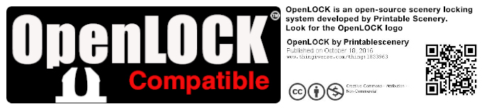

# OpenLOCKTrack
 OpenLOCK track tiles for 1:180 scale vehicular battle
## What is there ?

This is a repository of [OpenLOCK] (https://www.printablescenery.com/knowledgebase/openlock/) -compatible tiles for use with 1:180 scale (one inch represents fifteen feet).
This is three times as small as the regular OpenLOCK scale, which is approximately 1:60 (25 mm is 1:64, 28 mm is 1:58 ...).

Each tile represents a section of track, that can be attached to other sections using OpenLOCK clip to create a full race or combat track.

The tiles are meant to be printed using a 3D printer.

##  Licensing

The STL files are licensed CC-BY-NC (https://creativecommons.org/licenses/by-nc/3.0/), same as the OpenLOCK references STL (https://www.printablescenery.com/knowledgebase/openlock-developer-information/).

The Inkscape files are also licensed CC-BY-NC, same as the texture they include (from https://github.com/caitlynb/OpenSCAD-OpenLock).

All other files are also licensed CC-BY-NC, as it makes things a lot easier to have ervything under the same license.

## The logic behind the tiles

The track is 2" wide. In the past, I found such narrow track to be more fun as they force vehicles closer. Crashes and shootings are more likely that way :-) Also, 2" track fit well on a 3" wide piece. 3" track would need a 4" wide piece, causing longer print time, a larger track, and so on.

Nothing prevent to create 3" (or even wider) track, and compatibility pieces. Either a bit of Inkscape or some creative cutting & printing would do the trick (i.e. cut the 3"x3" into three 3"x1" piece and print the central part multiple times - corner will need a bit more work than that of course). 

"Level 0" track are almost flush with the original OpenLOCK base, with just enough depth for the embossed grid (about 0.4mm) . "Level 1" is 1/4 inch higher, "Level 2" is 1/4 inch above Lvl 1 (so 1/2 inch above Lvl 0), and so on. Lvl 0 are lighter, faster to print, and require less material than higher level. However, you can't have "negative feature" (i.e., potholes, ditch, ...) in a Lvl 0 track. You can in Lvl 1 and higher tracks.

The current tiles are limited by the availability of OpenLOCK base. For instance, there is no base with angle other than 90 or 45 degrees, so no 30 degree track. It's possible to design any kind of track on the grid, and then print the results on multiple OpenLOCK bases to reconstitute the original design. AS long as the entry and exit points of the design are compatible with the generic tiles, this should work just fine.

## How are the tiles created ?

### The basics

The bases are the reference bases for OpenLOCK, imported as-is in OpenSCAD. The Grass and Cobble texture are from the OpenSCAD-OpenLock
 project (https://github.com/caitlynb/OpenSCAD-OpenLock).

The surface is designed using Inkscape to create a heightmap in greyscale. This heightmap is converted to an object using the OpenSCAD surface() operator. Then it is stacked on the top of the proper OpenLOCK tile to created the finished piece. Some post-processing of the PNG file before OpenSCAD allows for some fun modifications without too much hassle (potholes, corner banking, soft ramps, ...)

### The detailed stuff

#### Introduction

The Inkscape drawing is exported to a PNG bitmap using the export tool. 

The auto-generator takes the PNG name as input, and generates the OpenSCAD code using the appropriate OpenLOCK base for the size - an EA tile for 3x3, an U tile for 4x4, and so on. Optionnaly, the auto-generator can extract part of the PNG file and fit it on a smaller piece. Smaller piece are faster to print, and the original design may have unnecessary area that need not be printed at all. For instance, a 90 degrees turn on a 4x4 area could be printed as a U piece, a pair of R pieces (4x2 each), a pair of OA pieces (4x4 triangular), or not completely on a V piece (quarter disk) or a pair of Y triangle. The 6x6 90 turn can be printed as a pair of EA (3x3) and a paire of E (2x2), only printing 26 square inches out of the original 36 - the excess 10 square inches only feature scenery, not track.

The auto-generator can also 'raise' the track by increment of 1/4 inch, to allow for raised tracks, jumps, and so on. Non-regular raising can be achieved by processing the PNG file before running the OpenSCAD code.

Some parts use hand-written OpenSCAD code, such as 3x1 ramps and 3x1 with text.

Finally, OpenSCAD is used to generated the STL. **BEWARE**: The surface() operator in OpenSCAD seems a bit memory-hungry. Generating the STL files from a 6"x6" PNG at 120 dpi takes around 20 GBytes of memory! The 3"x3" pieces are already requiring between 4 and 5 GB. So if you want to regenerate the files or make your own, make sure your computer can handle it.

#### Inkscape

The Inkscape file uses multiple layers.
From bottom to top:
1. A "black background layer" as a safety net (spurious white pixels would cause very high peak).
2. One (or more) "texture" layer for the non-track part of the tile. This can be changed at will easily for different texture, either by replacing the texture or by adding a new layer and hiding the other texture layers.
3. A "road surface" layer (grey 10) where the track is.
4. A "grid" layer with the embossed 1"x1" and 1/4"x1/4" grids, slightly darker (lower) than the road surface. The gris is a bit transparent, so that it doesn't show too much in the texture where the texture is brighter (higher).
5. A "border" layer. Border are currently created by repeating a 0.1" wide pattern along a path. The default pattern is quite light, so it sits on top of a black path 0.1" wide and the pattern is set to 30% opacity.
 
The default is to use 120 dpi for the exported PNG, which seems to work well. It's possible to use a different resolution, provided the auto-generated and hand-written OpenSCAD files are changed to match the dpi of the PNG file from inkscape. Naming is important, as the auto-generator tool uses it to 'guess' the size of the PNG.

The greyscale range of 0 (black) to 255 (white) is projected in OpenSCAD into a 0 to 10 mm height, so each extra 10 of luminance is about 0.4 mm. So adding 162 to the luminance of the PNG raise the track & features by 1/4" (6.35 mm) - the equivalent of a Level. This property is used by the pre-processing tools to create soft ramps (1/4" rise over 3") or potholes (raising eveything by 1/4" and then lowering the potholes) orting a Level 1 piece). Another possible use is banking (raising the outer part of a corner).

#### The auto-generator

The auto-generator takes the name of a PNG file (the name must start as MxN with M the width and N the length of the PNG, i.e. 3x3 for a 3"x3" PNG). It outputs the OpenSCAD using that file, picking the appropriate OpenLOCK base. Optionaly, it can extract only some of the PNG (a rectangular piece at an offset) and put it on a base appropriate for the extracted part. It can also do some specific cuttings for Y, OA or V base. It can also change the level for the whole piece.

It's not very well documented, and it's not very pretty C code. But it does the job :-)

#### OpenSCAD

As mentioned above, OpenSCAD can be VERY memory-hungry for the larger PNG. Cutting a large PNG in multiple OpenLOCK pieces doesn't help - each smaller pieces require the memory needed for the whole PNG, apparently.

#### Interoperability

TO be interoperable, the 2" wide track should be at height 0.4 mm over the base (7.4 mm high), plus 6.35 mm per Level. The track is centered in the middle of a 3" wide segment of OpenLOCK tile. The track is surrounded by a 0.1 inch (2.54 mm) wide border on each side. The rest of the tile is texture or scenery (which is a lot more difficult to make interoperable with multiple Levels !).
